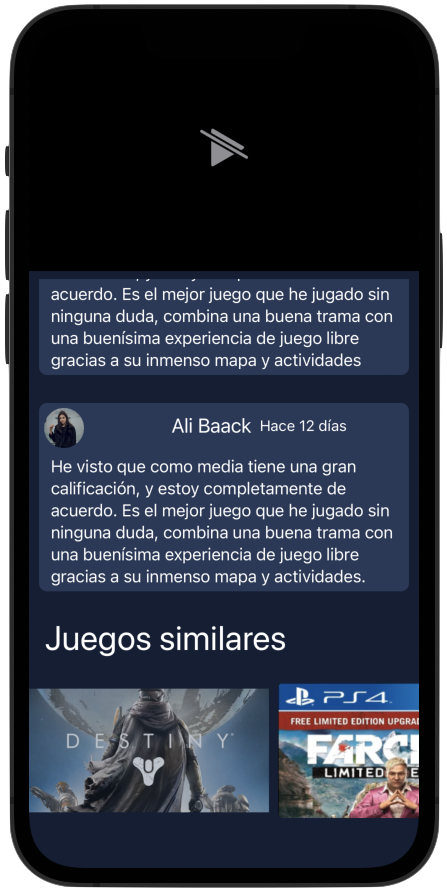

# game-stream
App para acceder a información de videojuegos y compartir comentarios.

## Instalación

Utiliza la dependencia [Kingfisher](https://swiftpackageindex.com/onevcat/Kingfisher) para tratar las imagenes.

Para usarlo solo debe importar la dependencia
```bash
import Kingfisher
```

API que consume para el funcionamiento de algunas secciones:
```bash
https://gamestream-api.herokuapp.com/api/games
```

Tiene una barra de búsqueda y categorias para facilitar la búsqueda de algún videojuego, puedes personalizar tu cuenta y que te de sugerencias de videojuegos.

<p align="center">
	
	
	
	
</p>


